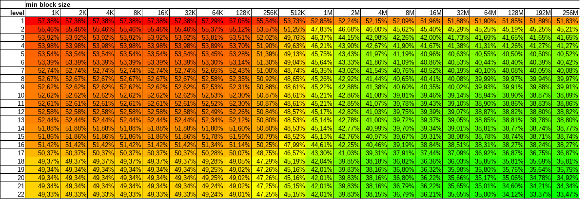
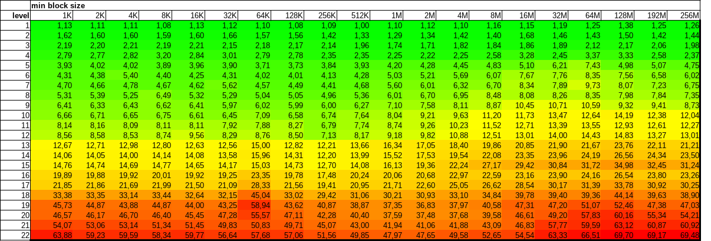

[](https://github.com/martinellimarco/t2sz/actions)
[](https://github.com/martinellimarco/t2sz/blob/main/LICENSE)
[](https://snapcraft.io/t2sz)

# t2sz
It allows to compress a file or a tar archive with [Zstandard](https://github.com/facebook/zstd) splitting the file into multiple frames.

It has 2 mode of operation. Tar archive mode and raw mode.

By default it runs in tar archive mode for files ending with `.tar`, unless `-r` is specified.

For all other files it runs in raw mode.

In tar archive mode it compress the archive keeping each file in a different frame, unless `-s` or `-S` is used.

This allows fast seeking and extraction of a single file without decompressing the whole archive.

When `-s SIZE` is used in tar mode and a file is added, if the size of the file is less than `SIZE` then another one will be added in the same block, and so on until the sum of the sizes of all files packed together is at least `SIZE`. A file will be never truncated as `SIZE` is just a minimum value.

When `-s SIZE` is used in raw mode then it defines exactly the input block size. If there isn't enough input data the block will be smaller.

When `-S SIZE` is used files bigger than `SIZE` will be splitted in blocks of `SIZE` length. It is available only in tar mode.

A single block of one or more files is compressed into a single Zstandard frame. If the files in the same block are correlatable the compression ratio will be higher.

The compressed archive can be uncompressed with any Zstandard tool, including `zstd`.

To take advantage of seeking see the following projects:
- C/C++ library:  [libzstd-seek](https://github.com/martinellimarco/libzstd-seek)
- Python library: [indexed_zstd](https://github.com/martinellimarco/indexed_zstd)
- FUSE mount:     [ratarmount](https://github.com/mxmlnkn/ratarmount)


# Build

You'll need `libzstd-dev`

```bash
sudo apt install libzstd-dev
```

```bash
git clone https://github.com/martinellimarco/t2sz
mkdir t2sz/build
cd t2sz/build
cmake .. -DCMAKE_BUILD_TYPE="Release"
make
```

Install with

```bash
sudo make install
```

Or if you want a debian package you can run

```bash
cpack
```

then install it with

```bash
sudo dpkg -i t2sz*.deb
```

# Usage

```commandline
Usage: ./t2sz [OPTIONS...] [TAR ARCHIVE]

Examples:
        ./t2sz any.file -s 10M                        Compress any.file to any.file.zst, each frame will be of 10M
        ./t2sz archive.tar                            Compress archive.tar to archive.tar.zst
        ./t2sz archive.tar -o output.tar.zst          Compress archive.tar to output.tar.zst
        ./t2sz archive.tar -o /dev/stdout             Compress archive.tar to standard output

Options:
        -l [1..22]         Set compression level, from 1 (lower) to 22 (highest). Default is 3.
        -o FILENAME        Output file name.
        -s SIZE            In raw mode: the exact size of each input block, except the last one.
                           In tar mode: the minimum size of an input block, in bytes.
                                        A block is composed by one or more whole files.
                                        A file is never truncated unless -S is used.
                                        If not specified one block will contain exactly one file, no matter the file size.
                                        Each block is compressed to a zstd frame but if the archive has a lot of small files
                                        having a file per block doesn't compress very well. With this you can set a trade off.
                           The greater is SIZE the smaller will be the archive at the expense of the seek speed.
                           SIZE may be followed by the following multiplicative suffixes:
                               k/K/KiB = 1024
                               M/MiB = 1024*1024
                               kB/KB = 1000
                               MB = 1000*1000
        -S SIZE            In raw mode: it is ignored.
                           In tar mode: the maximum size of an input block, in bytes.
                           Unlike -s this option may split big files in smaller chuncks.
                           Remember that each block is compressed independently and a small value here will result in a bigger archive.
                           -S can be used together with -s but MUST be greater or equal to it's value.
                           If -S and -s are equal the input block will be of exactly that size, if there is enough input data.
                           Like -s SIZE may be followed by one of the multiplicative suffixes described above.
        -r                 Raw mode or non-tar mode. Treat tar archives as regular files, without any special treatment.
        -v                 Verbose. List the elements in the tar archive and their size.
        -f                 Overwrite output without prompting.
        -h                 Print this help.
        -V                 Print the version.

```

# About -s and -l

One may wonder what are the best choices for minimum block size `-s` and compression level `-l`.

The real answer is that it depends on the kind of data you are working with. In short, do your own math and feel free to report your results.

If you are working with big files (hundreds of MiB) then you will not have many benefits in terms of seeking time if you use `-s`, but you should increase your compression level to get smaller archives.

On the other hand, if you have thousands of small files (few MiB or less) that usually compress well and are correlated you may take advantage of both `-s` and `-l`.

What follows is a test I made with a dataset of ~100.000 binary files less than 4MiB in size. The exact numbers are not important.

The first table shows the compression ratio of each combination of `-s` (min block size) and '-l' (level).

Intuitively at `-s 1K -l 1` the resulting archive is 57.38% of the size of the uncompressed .tar archive.

At the same time `-s 256M -l 22` gives the best results in term of compression ration, with a generated archive that is only 33.47% of the original.

Obviously seeking in a block of 256M is not that quick: a safer choice in this particular case is something around `-s 32M`.

The second table shows the time it took to compress each archive, divided by the minimum time.

The fastest choice is at `-s 512K -l 1` while at `-s 256M -l 22` we get the slowest one, that takes 69.48 times more.







# License

See LICENSE

# Release

Download the latest stable source code or .deb from the [release page](https://github.com/martinellimarco/t2sz/releases/latest). This is the raccomanded version.

# Snap

For your convenience you can install the latest release from the [snap store](https://snapcraft.io/t2sz) but beware that it is distributed in strict mode and it can access only your home directory by default.

You can add access to removable devices such as those stored in `/media` with `sudo snap connect t2sz:removable-media`.

If you want to give it access to every file you can install it with `--devmode`.

[](https://snapcraft.io/t2sz)
